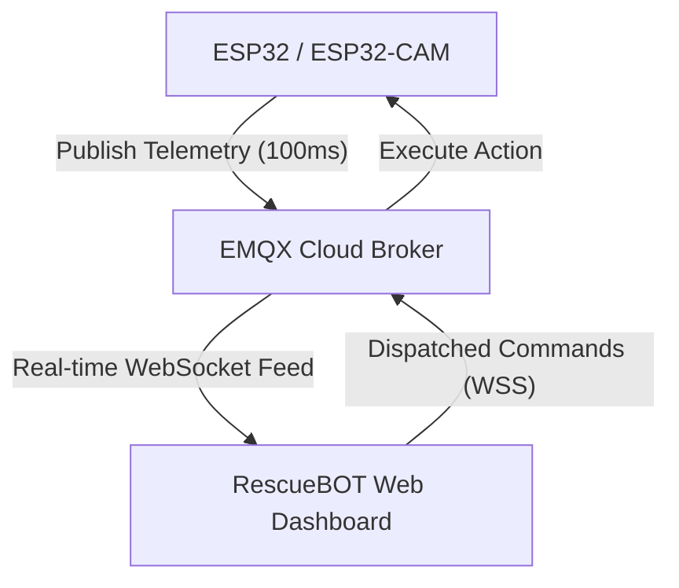

# RescueBOT | Tactical IoT Command Center 🛡️

**RescueBOT** is a next-generation, high-performance mission control dashboard designed for autonomous disaster response and search-and-rescue operations. Developed for high-stakes **Hackathons**, this project bridges the gap between rugged hardware and premium software aesthetics.

<p align="left">
  
  
  
  
</p>

---

## 🏆 Hackathon Edition
Built for reliability, speed, and real-time visualization, RescueBOT provides first responders with a unified tactical interface to monitor hazardous environments.

### 👥 The Team: RescueBOT (BOT THINGS)
* **Prolayjit Biswas** — *Team Lead | Lead Software | Hardware Support*
* **Arghya Roy** — *Lead Hardware Engineer*
* **Shubhajit Haldar** — *Team Member*
* **Papan Chowdhury** — *Team Member*

---

## 🚀 Key Features

### 💻 Web Dashboard Modules
* **Mission Initialization**: A cinematic, high-tech boot sequence that performs system diagnostic checks before granting access to mission control.
* **Mission Overview (Live Dashboard)**: A high-density tactical overview featuring real-time telemetry cards, active alert lists, and mini-map/camera previews.
* **Live Vision Array**: Full-screen low-latency video feed with integrated AI analytics for human and motion detection.
* **Tactical Mapping**: Geospatial tracking powered by Leaflet, displaying live GPS coordinates and mission-critical waypoints.
* **Sensor Monitor**: Specialized view for deep-diving into high-frequency telemetry data with real-time pulse updates.

### 🤖 Hardware Capabilities
* **Environmental Awareness**: Continuous monitoring of hazardous gases, smoke, and atmospheric conditions.
* **Structural Diagnostics**: 6-axis vibration monitoring to detect structural instability in rescue zones.
* **Obstacle Avoidance**: Ultrasonic-based distance detection for safe robot navigation.
* **Geospatial Intelligence**: High-precision GPS localization for coordinated field operations.

---

## 🛠️ Hardware Stack & Pin Map

### Core Controllers
* **ESP32 Dev Board**: The central nervous system handling telemetry, logic, and MQTT communication.
* **ESP32-CAM**: Dedicated detection node for real-time visual feedback and AI processing.

### Sensor Suite Connection Map
| Sensor Module | Physical Pin | Purpose / Reading | Topic |
|---|---|---|---|
| **MQ-2 Gas Sensor** | GPIO 12 (Analog) | Detects LPG, Smoke, and Alcohol levels | `ares1/Robot/telemetry` |
| **MPU6050 Gyro/Accel** | I2C (SDA/SCL) | Structural vibration & robot tilt | `ares1/Robot/telemetry` |
| **DHT11 Temp/Humidity**| GPIO 13 | Ambient temperature & humidity levels | `ares1/Robot/telemetry` |
| **HC-SR04 Ultrasonic** | GPIO 2 & 16 | Collision avoidance & proximity mapping | `ares1/Robot/telemetry` |
| **NEO-6M GPS Module** | Hardware Serial | High-precision latitude & longitude | `ares1/Robot/gps` |
| **Flame Sensor** | GPIO 15 (Digital) | Immediate thermal fire source detection | `ares1/Robot/telemetry` |

---

## 📡 IoT & Communication Pipeline

RescueBOT utilizes a decoupled, event-driven architecture to ensure seamless synchronization between the physical robot and the web dashboard.



### 1. The MQTT Pipeline
* **Broker**: EMQX Cloud (WSS Protocol)
* **Latency**: < 100ms real-time synchronization.
* **Payload**: Structured JSON packets for telemetry, GPS, and status.

### 2. Connection Flow
1. **Hardware Boot**: ESP32 connects to WiFi and establishes a secure WebSocket connection to the MQTT broker.
2. **Telemetry Publishing**: Sensors are polled; data is published to `ares1/Robot/telemetry`.
3. **Dashboard Subscription**: The Web Dashboard (using `mqtt.js`) subscribes to all mission topics and updates the UI using an event-driven listener system.
4. **Command Dispatch**: User actions on the web UI (like "Start Stream" or "Toggle Flash") are published as commands that the ESP32 executes immediately.

---

## 📂 Project Architecture

```text
├── dashboard/       # Tactical Overview module (dashboard.html, css, js)
├── camera/          # AI Vision & Detection module (camera.html, css, js)
├── map/             # Geospatial Tracking module (map.html, css, js)
├── sensors/         # High-density Telemetry module (sensors.html, css, js)
├── shared/          # Centralized Design System & MQTT Client config
├── assets/          # Mission-critical UI images
├── firmware/        # Arduino/C++ source code for ESP32 (tets.ino)
└── index.html       # RescueBOT Entry Point (High-Tech Diagnostic Sequence)
```

---

## ⚙️ Setup & Deployment

### Local Development
1. **Install Dependencies**:
   ```bash
   npm install
   ```
2. **Launch Local Dev Server**:
   ```bash
   npm run dev
   ```
3. **Build Production Build**:
   ```bash
   npm run build
   ```

### Cloud Deployment
This project is configured and optimized for zero-config deployments on **Vercel**. Every push to the `main` branch triggers an automated build using **Vite**, delivering a high-performance, edge-deployed mission control center.

---
**RescueBOT Mission Control** | *Empowering Rescue Missions through IoT & AI*  
© 2026 TEAM BOT THINGS
